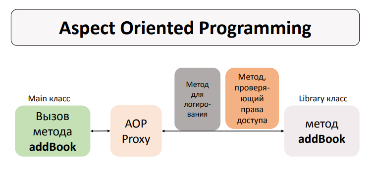
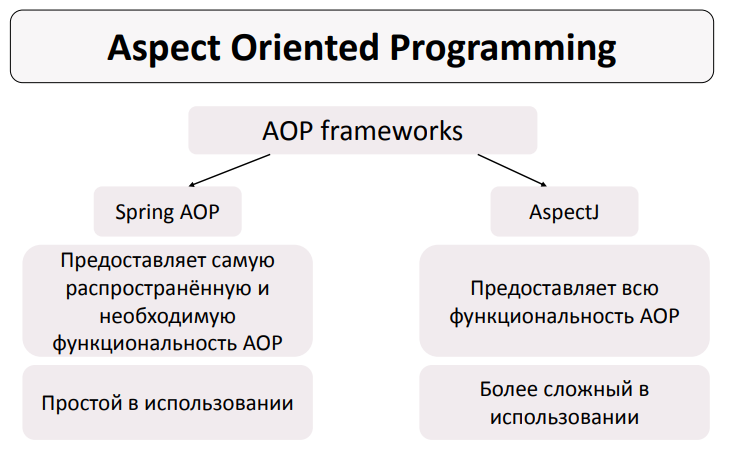
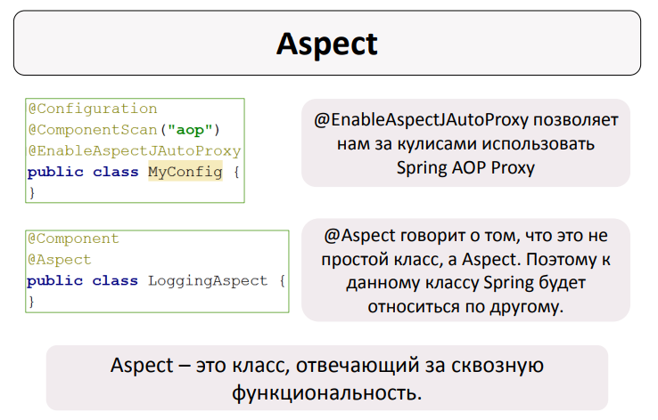
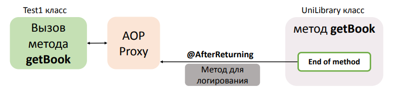
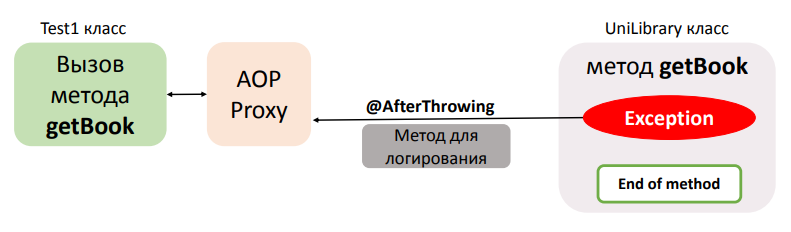
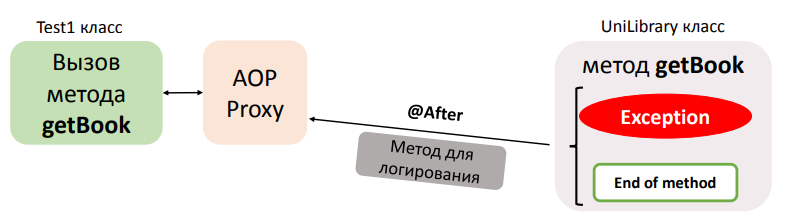
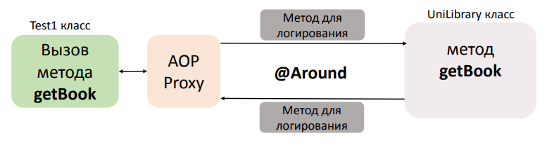

<h1 align="center">
    Aspect Oriented Programming (AOP) 
</h1>

**Aspect Oriented Programming (AOP)** - парадигма программирования, основанная на идее разделения основного и служебного
функционала. Служебный функционал записывается в Aspect-классы.

В основе Aspect заключена **сквозная логика (cross-cutting logic).**

<h5>
  AOP - паттерн ПРОКСИ!
</h5>

<h3>
    Проблемы, которые пытается решать AOP 
</h3>

- Переплетение бизнес-логики со служебным функционалом (Code tangling). Метод становится громоздким, и его основной
  функционал сразу не заметно.
- Разбросанность служебного функционала по всему проекту (Code scattering). При необходимости что-то изменить в
  служебном функционале, мы должны будем делать изменения во всех классах.

<h3>
  Пример проблемы сплетения бизнес логики и сквозного функионала в коде 
</h3>

**Рассмотрим пример когда, когда происходит черезмерное смешение бизнес логики и сквозного функционала на примере с
кодом.**

Рассмотри некоторую сферическую службу в вакууме (например, web-сервис), реализующую следующий метод:

```java
  public BookDTO getBook(Integer bookId) {
    BookDTO book = bookDAO.readBook(bookId);
    return book;
}
```

Метод довольно прост и очевиден: чтение информации о некоторой книге по её идентификатору. Но давайте подумаем, чего тут
не хватает? Первым делом нам стоит задуматься о логировании – без него, как вы сами понимаете, в web-службе никуда:

```java
  public BookDTO getBook(Integer bookId) {
    LOG.debug("Call method getBook with id " + bookId);

    BookDTO book = bookDAO.readBook(bookId);

    LOG.debug("Book info is: " + book.toString());
    return book;
}
```

Далее необходимо реализовать обработку исключений (сделать так, что бы слой служб возвращал соответствующие ему
исключения, скрывая исключения нижележащих слоёв):

```java
public BookDTO getBook(Integer bookId) throws ServiceException {
    LOG.debug("Call method getBook with id " + bookId);
    BookDTO book = null;

    try {
        book = bookDAO.readBook(bookId);
    } catch (SQLException e) {
        throw new ServiceException(e);
    }

    LOG.debug("Book info is: " + book.toString());
    return book;
}
```

Так же не стоит забывать о проверке прав доступа:

```java
public BookDTO getBook(Integer bookId) throws ServiceException, AuthException {
    if (!SecurityContext.getUser().hasRight("GetBook"))
        throw new AuthException("Permission Denied");

    LOG.debug("Call method getBook with id " + bookId);
    BookDTO book = null;

    try {
        book = bookDAO.readBook(bookId);
    } catch (SQLException e) {
        throw new ServiceException(e);
    }

    LOG.debug("Book info is: " + book.toString());
    return book;
}
```

Можно продолжать совершенствовать данный метод, но для начала — достаточно. В ходе наших доработок мы получили метод в
10 раз (с 2 до 20 LOC) превышающий исходный размер. Самое интересное, что объём бизнес-логики в нём не изменился – это
всё та же 1 строка. Остальной код реализует некоторую общую служебную функциональность приложения: логирование,
обработку ошибок, проверку прав доступа, кеширование и так далее.

<h3>
    Примеры сквозного функционала
</h3>

- Логирование
- Проверка прав (security check)
- Обработка транзакций
- Обработка исключений
- Кэширование

<h5>
  Схема работы аспектов на примере логгирования и проверки прав доступа
</h5>



<h3>
  Историческая справка
</h3>

Само по себе **AOP** появилось и живет независимо от Spring-а и представлена фреймворком **Aspectj**.



Но поскольку идеи и механизмы **AOP** прикольны и гениальны, то со временем в **Spring** добавили поддержку **AOP** в
виде пакеты **Spring-AOP**.

Однако **Spring-AOP** не является автономным модулем Spring-a и требует подключение фреймворка **AspectJ**:

```kotlin
implementation("org.aspectj:aspectjrt:1.9.22")
implementation("org.aspectj:aspectjweaver:1.9.22")
```

<h1>
  Работа с Spring-AOP
</h1>



<h3>
  Советы по работе с AOP
</h3>

- Если вы решите работать с Аспектами через XML, что сложно и муторно, то поищите материал в Интернете. Если начать это
  освещать и расписывать здесь, то выйдет многотомник.
- С аспектами легко работать используя XML+Annotation или Java-Code контексты.
- В ваше ЛР без разницы каким образом вы будете работать с контекстом (так что оставьте попытки работать через XML-файл)

<h3>
  Advice типы
</h3>

| Advice тип      | Описание                                                                                     |
|-----------------|----------------------------------------------------------------------------------------------|
| @Before         | выполняется до метода с основной логикой                                                     |
| @AfterReturning | выполняется только после нормального окончания метода с основной логикой                     |
| @AfterThrowing  | выполняется после окончания метода с основной логикой только, если было выброшено исключение |
| @After          | выполняется после окончания метода с основной логикой                                        |
| @Around         | выполняется до и после метода с основной логикой                                             |

<h3>
  Advice и Pointcut
</h3>

- **Advice** – метод, который находится в Aspect-е и содержит сквозную логику. Advice определяет, что и когда должно
  происходить. В идеале **Advice** должен быть небольшим и быстро работающим.
- **Pointcut** - выражение, описывающее где должен быть применён **Advice**.

<h3 align="center">
  Pointcut
</h3>

**Pointcut** – выражение, описывающее где должен быть применён Advice.

**Spring AOP** использует **AspectJ Pointcut expression language**. Т.е. определённые правила в написании выражений для
создания **Pointcut**.

```java
execution(modifiers-pattern?return-type-pattern declaring-type-pattern?
        method-name-pattern(parameters-pattern) throws-pattern?)
```

<h5 align="center">
  Примеры Pointcut
</h5>

| Пример Pointcut                                       | Описание                                                                                                                                                                                                                    |
|-------------------------------------------------------|-----------------------------------------------------------------------------------------------------------------------------------------------------------------------------------------------------------------------------|
| ```execution(public void getBook())```                | Соответствует методу без параметров, где бы он ни находился с access modifier = public, return type = void и именем = getBook                                                                                               |
| ```execution(public void aop.UniLibrary.getBook())``` | Соответствует методу без параметров, из класса UniLibrary с access modifier = public, return type = void и именем = getBook                                                                                                 |
| ```execution(public void get*())```                   | Соответствует методу без параметров, где бы он ни находился с access modifier = public, return type = void и именем, начинающимся на «get»                                                                                  |
| ```execution(* getBook())```                          | Соответствует методу без параметров, где бы он ни находился с любым access modifier, любым return type и именем = getBook                                                                                                   |
| ```execution(* *())```                                | Соответствует методу без параметров, где бы он ни находился с любым access modifier, любым return type и любым именем                                                                                                       |
| ```execution(public void getBook(String))```          | Соответствует методу с параметром String, где бы он ни находился с access modifier = public, return type = void и именем = getBook                                                                                          |
| ```execution(public void getBook(*))```               | Соответствует методу с любым одним параметром, где бы он ни находился с access modifier = public, return type = void и именем = getBook                                                                                     |
| ```execution(public void getBook(..))```              | Соответствует методу с любым количеством любого типа параметров, где бы он ни находился с access modifier = public, return type = void и именем = getBook                                                                   |
| ```execution(public void getBook(aop.Book, ..))```    | Соответствует методу, первым параметром которого является aop.Book, а дальше может идти 0 и больше параметров любого типа, где бы этот метод ни находился с access modifier = public, return type = void и именем = getBook |
| ```execution(* *(..))```                              | Соответствует методу с любым количеством любого типа параметров, где бы он ни находился с любым access modifier, любым return type и любым именем                                                                           |

<h3 align="center">
  Порядок выполнения Aspect-ов
</h3>

Если при вызове 1-го метода с бизнес-логикой срабатывают несколько Advice-ов, то нет никакой гарантии в порядке
выполнения этих Advice-ов.

Для соблюдения порядка такие Advice-ы нужно распределять по отдельным упорядоченным Aspect-ам

```@Order(3)``` упорядочивает Aspect-ы. Чем меньше число, тем выше приоритет.

```java

@Component
@Aspect
@Order(3)   //задание приоритета аспекта
public class SomeAspect {
    //
}
```

<h3 align="center">
  JoinPoint и ProceedingJointPoint
</h3>

**Joint Point** – это точка/момент в выполняемой программе когда следует применять Advice. Т.е. это точка переплетения
метода с бизнес-логикой и метода со служебным функционалом.

Прописав **Joint Point** в параметре метода Advice, мы получаем доступ к информации о сигнатуре и параметрах метода с
бизнеслогикой.

```java

@Before("execution(public void getBook())")
public void beforeGetBookAdvice(JoinPoint joinPoint) {
    //
}
```

**Proceeding Joint Point** - интерфейс расширяющий **Joint Point** добаввляющий два метода ```proceed```, которые
вызывают основной метод. Данный тир используется в **Around Advice**. Поскольку ```@Around``` работает "вокруг" метода,
то мы должны явно в нем вызвать выполнение метода.

*Around advice самый сильный, могущий, сложный и может почти всё!*  

<h3 align="center">
  Advice @Before
</h3>

**@Before Advice** выполняется до метода с основной логикой. В нем можно перехватить аргументы, переданные в метод.
Например для логирования или проверки.

```java

@Before("execution(public void getBook())")
public void beforeGetBookAdvice(JoinPoint joinPoint) {
    //
}
```

<h3 align="center">
  Advice @AfterReturning
</h3>

**@AfterReturning Advice**  выполняется только после нормального окончания метода с основной логикой, но до присвоения
результата этого метода какой-либо переменной. Поэтому с помощью @AfterReturning Advice возможно изменять возвращаемый
результат метода.

```java
//В returning указывается имя параметра, который будет перехватываться
//Указали название в аннотации, такое же название принимаем в качестве параметра
@AfterReturning(pointcut = "execution(* getStudents())", returning = "students")
public void afterReturningGetStudentsLoggingAdvice(JoinPoint joinPoint, List<Student> students) {
    //
}
```



<h3 align="center">
  Advice @AfterThrowing
</h3>

**@AfterThrowing Advice** не влияет на протекание программы при выбрасывании исключения. С помощью @AfterThrowing Advice
можно получить доступ к исключению, которое выбросилось из метода с основной логикой.

```java
//В throwing указывается имя исключения, которое будет перехватываться
//Указали название в аннотации, такое же название принимаем в качестве параметра
@AfterThrowing(pointcut = "execution(* getStudents())", throwing = "exception")
public void afterThrowingGetStudentsLoggingAdvice(JoinPoint joinPoint, Throwable exception) {
    //
}
```



<h3 align="center">
  Advice @After
</h3>

**@After Advice** выполняется после окончания метода с основной логикой вне зависимости от того, завершается ли метод
нормально или выбрасывается исключение.

С помощью @After Advice невозможно:

1. Получить доступ к исключению, которое выбросилось из метода с основной логикой;
2. Получить доступ к возвращаемому методом результату.

```java

@After("execution(* getStudents())")
public void afterGetStudentsLoggingAdvice(JoinPoint joinPoint) {
    //
}
```



<h3 align="center">
  Advice @Around
</h3>

**@Around Advice** выполняется до и после метода с основной логикой.

С помощью @Around Advice возможно:

1. Произвести какие-либо действия до работы target метода;
2. Произвести какие-либо действия после работы target метода;
3. Получить результат работы target метода/изменить его;
4. Предпринять какие-либо действия, если из target метода выбрасывается исключение.

```java

@Around("execution(public void giveBookToPerson(String, aop.Person))")
public Object AroundDiveBookToPersonAdvice(ProceedingJoinPoint proceedingJoinPoint) throws Throwable {
//
}
```

Используя **@Around Advice** возможно предпринять следующие действия, если из target метода выбрасывается исключение:

- Ничего не делать
- Обрабатывать исключение
- Пробрасывать исключение дальше



<h3>
  Пример
</h3>

В [примере](Main.java) рассматривается лишь не большая часть из того, что здесь написано. Написано здесь довольно мало, ведь аспекты это целый фреймворк и отдельный мир...

<h3 align="center">
Источники
</h3>

- [Udemy: Spring для начинающих](https://www.udemy.com/share/103Kdu3@xkrwOVo44xeb1OFHkiGGglSIgIQEDLPXf2gCC-estlo3GkCMgDoAhe2A5xGIej-khA==/)
- [Habr: знакомство с AOP](https://habr.com/ru/articles/114649/)
- [JavaRush: поддержка AspectJ](https://javarush.com/quests/lectures/questspring.level01.lecture61)