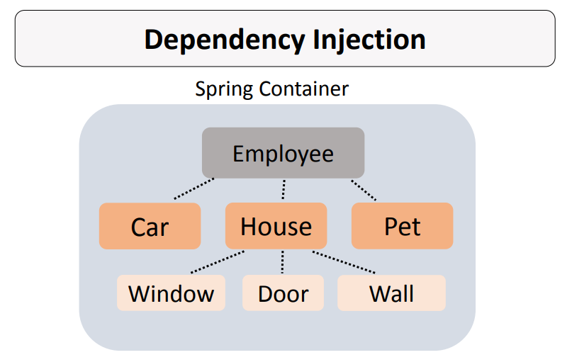
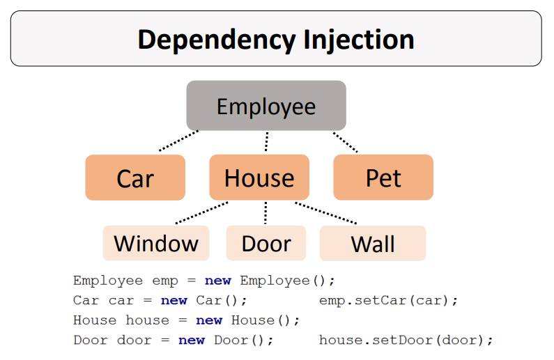
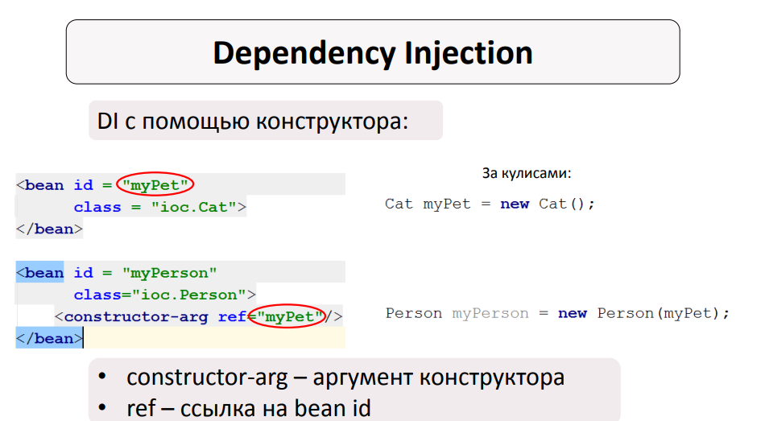
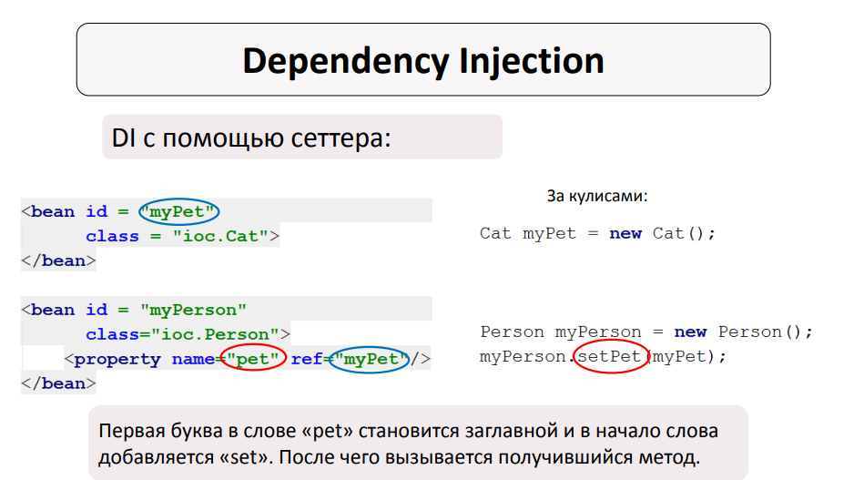
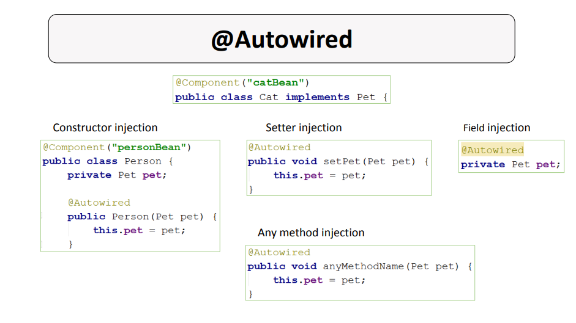
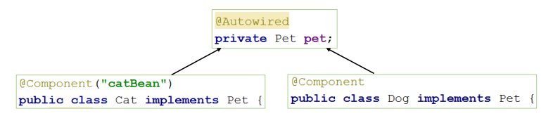
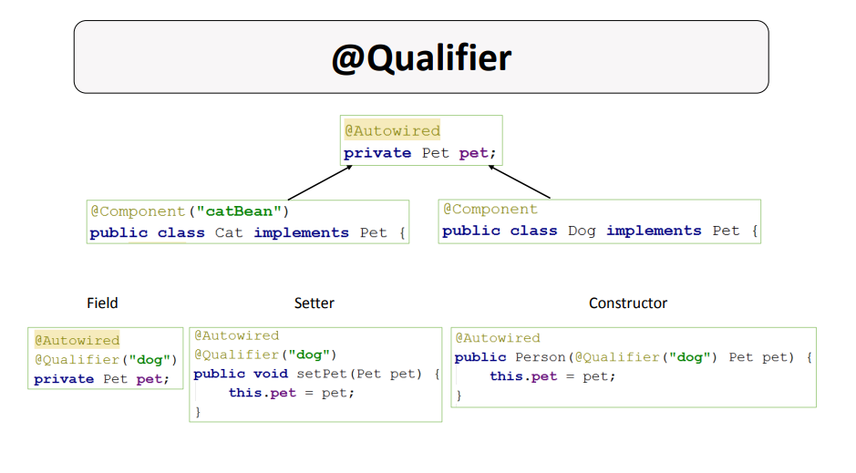

<h1>
    Dependency Injection
</h1>

**Dependency Injection (DI)** – аутсорсинг добавления/внедрения зависимостей. В нашем случае данными операциями будет
заниматься **Spring Container**. Мы опять передаем управление объектами и внедрение объектов (композицию) Spring-у. Т.е.
**DI** это неотъемлимая часть **IoC** (поэтому зачастую данные понятия ходят друг за другом или заменяют друг друга). DI
делает объекты нашего приложения слабо зависимыми друг от друга.

В большинстве случаев нам не интересно просто передавать объекты в управление Spring-у, мы хотим получить возможность
гибко менять композици засчет **DI**. А делать мы это может за счет работы через **ИНТЕРФЕЙСЫ!!!**




<h5>
    Способы задания DI
</h5>

В зависиомсти от выбранного стиля работы с контекстом у нас есть два пути задания внедрения зависимостей:

1. **При помощи XML-файла.** Если мы работаем с контекстом только через XML-файл, где описывается конфигурация бинов.
2. **При помощи аннотаций.** Если мы работаем при помощи XML-файла + аннотаций или Java-кода.

<h3 align="center">
    Конфигурация через XML файл.
</h3>

Если мы работаем с контекстом через XML-файл, где описываются бины, то логично что и их композиции описываются тамже.

При работе с XML-файлом нам доступны два способа внедрения зависимостей, через конструктор или через сеттеры.

<h5 align="center">
    DI с помощью конструктора
</h5>

1. Создайте класс бина, который будет внедряться. Для обеспечения гибкости данный класс должен реализовывать интерфейс.
2. Создайте класс бина, в который будет внедряться зависимость. Класс должен содержать в себе поле с типом интерфейса
   под который уже будет подставляться конкретная реализация.
3. Создайте в этом классе конструктор, который будет в качестве параметра принимать тип интерфейса.
4. Опишите бины классов в XML-файле. В бине, в который внедряется зависимость должен быть параметр конструктора, который
   ссылается на
   нужный бин по id бина.

```java
interface Pet {
}

class Cat implements Pet {
}

class Dog implements Pet {
}

class Person {
    private Pet pet;

    public Person(Pet pet) {
        this.pet = pet;
    }
}
```



<h5 align="center">
    DI с помощью сеттера
</h5>

1. Создайте класс бина, который будет внедряться. Для обеспечения гибкости данный класс должен реализовывать интерфейс.
2. Создайте класс бина, в который будет внедряться зависимость. Класс должен содержать в себе поле с типом интерфейса
   под который уже будет подставляться конкретная реализация.
3. Создайте в данном классе сеттер для поля типа интерфейса.
4. Опишите бины классов в XML-файле. В бине, в который внедряется зависимость должно быть свойство, которое ссылается на
   нужный бин по id бина.

```java
interface Pet {
}

class Cat implements Pet {
}

class Dog implements Pet {
}

class Person {
    private Pet pet;

    public Person() {
    }

    public void setPet(Pet pet) {
        this.pet = pet;
    }
}
```



Пример DI при помощи XML-файла: [xml](xml) + resources/dependencyInjectionContext.xml


<h3 align="center">
    Конфигурация при помощи аннотаций
</h3>

При работе с бинами, которые помечаются аннотацией ```@Component``` достаточно пометить место внедрения
аннотацией ```@Autowired```. Работает это внезависимости от того какой тип сканирования выбран: через XML-файл или
через Java код.

Процесс внедрения зависимостей при использовании ```@Autowired``` такой:

1. Сканирование пакета, поиск классов с аннотацией @Component.
2. При наличии аннотации @Autowired начинается поиск подходящего по типу бина.
3. Далее ситуация развивается по одному из сценариев:
    - Если находится 1 подходящий бин, происходит внедрение зависимости;
    - Если подходящих по типу бинов нет, то выбрасывается исключение;
    - Если подходящих по типу бинов больше одного, тоже выбрасывается исключение.

Аннотация ```@Autowired``` позволяет внедрять зависимости тремя путями:

1. Внедрение через конструктор.
2. Внедрение через сеттер.
3. Внедрение поля.



<h5 align="center">
    @Qualifier
</h5>



Если при использовании ```@Autowired``` подходящих по типу бинов больше одного, то выбрасывается исключение.
Предотвратить выброс данного исключения можно конкретно указав, какой бин должен быть внедрён. Для этого и используют
аннотацию ```@Qualifier```.



Пример DI при аннотаций: [annotation](annotation)