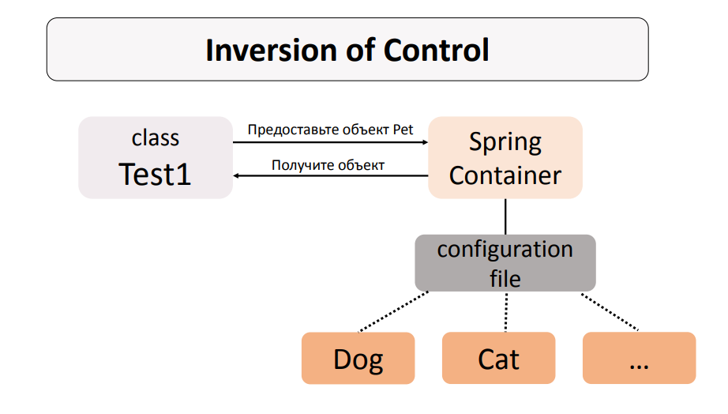

<h1 align="center">
    Inversion of Control
</h1>

**Inversion of Control (IoC)** - аутсорсинг создания и управления объектами. Т.е. передача программистом прав на
создание и управление объектами Spring-у. *Инверсия управления - объектами управляет уже не программист, а внешняя
сущность, в данном случае Spring*.



В самом простом понимании **Spring Container** или **Spring IoC Container** или **Spring DI Container** это то самое
асбтрактное, не видимое нам, хранилище, где Spring содержит подвластные ему объекты.

<h5 align="center">
    Основные функции, которые выполняет Spring Container
</h5>

- **IoC** – инверсия управления. Создание и управление объектами.
- **DI – Dependency Injection**. Внедрение зависимостей.

<h5>
    Spring Bean
</h5>

**Spring Bean (или просто bean)** – это объект, который создаётся и управляется Spring Container.


<h1 align="center">
    Контекст
</h1>

**ApplicationContext** представляет собой Spring Container. Поэтому для получения бина из **Spring Container** нам нужно
создать **ApplicationContext**.

*Упрощенно: под контекстом подразумивается то, откуда получает данные **Spring Container***.

<h5>
    О структуре Spring-проектов
</h5>

**ВАЖНО!!!** В каталоге ```main``` находятся два подкаталога: ```java``` (синенький, помеченный как Sources root)
и ```resources``` (с иконочкой БД). В ```java``` пишется код проекта, а в ```resources``` храняться все конфигурационные
файлы. Это типичная структра для Java проектов. Во всех фреймворка/библиотеках определены пути по умолчанию именно к
этим каталогам. **Соблюдайте данную структуру для избежания лишних проблем!!!**

<h5>
    Способы задания конфигурации (контекста)
</h5>

1. **XML-файл**
2. **Аннотации + XML-файл**
3. **Java code** *Пример: [ioc/code]()*

<h3 align="center">
    Конфигурация через XML файл.
</h3>

При конфигурации через XML файл необходимо воспользоваться классом ```ClassPathXmlApplicationContext``` и передать в
него название файла конфигурации, который должен лежать в **resources/**. **В данном случае в XML файле прописывается
конфигурация бинов.**

При задании контекста через XML поддерживаются следующие виды инициализации бинов:

1. Через конструктор с параметрами.
2. Через сеттеры.
3. Через внутренний фабринчый метод (метод определнный внутри класса создаваемых объектов).
4. Внешний фабричный метод (отдельный класс фабрики).

Пример: [xml](xml) + ```resources/applicationContext.xml```


<h3 align="center">
    Конфигурация при помощи Аннотация и XML-файла
</h3>

При конфигурации через Аннотации и XML файл также необходимо воспользоваться
классом ```ClassPathXmlApplicationContext``` и передать в него название файла конфигурации, который должен лежать в
**resources/**. В данном случае в XML файле указывается лишь путь к пакетам для сканирования бинов, определнных через
аннотации.

```xml

<context:component-scan base-package="ioc.mix"/>
```

Классы, бины которых необходимо получать помечаются аннотацией @Component.

```java

@Component
public class ComponentBySetters {
    //
}
```

Аннотация ```@Component``` указывает, что объекты данного класса будут бинами, т.е. будут создаваться и управляться
Spring Container.

При задании контекста в смешанном виде через аннотации и XML-файл поддерживаются следующие виды
инициализации бинов:

1. Через конструктор с параметрами.
2. Через сеттеры.

Задание значений в конструторе/сеттерах происходит при помощи аннотации ```@Value```, где можно задать явное значение
или воспользоваться подставновкой из файла ```resources/*.property```.

Более детально всё описывается в примере: [mix](mix) + ```resources/autoScanContext.xml```


<h3 align="center">
    Конфигурация при помощи Java кода
</h3>

При конфигурации через Java код необходимо воспользоваться классом ```AnnotationConfigApplicationContext``` и передать в
него класс, который является конфигурационным и отмечен аннотацией ```@Configuration```.

При конфигурации через Java код доступно два способа инциализации бинов: через фабрику бинов или через сканирование
пакета на наличее ```@Component``` классов.

<h5 align="center">
    Работа с фабрикой бинов
</h5>

1. Создаем обычный Java класс, который будет бином. Никаких дополнительных манипуляции или аннотаций не надо.
2. Создаем конфигурационный класс, который помечаем аннотацией ```@Configuration```.
3. Внутри ```@Configuration``` класса создаются методы получения бинов (Фабричные методы бинов) и помечаются
   аннотацией ```@Bean```. Сигнатура метода должна выглядить следующим образом: ```public TypeA typeA()```, а внутри
   возвращаться объект класса, созданный оператором new.

```java

@Configuration
public class ScanBeanConfig {
    @Bean
    public ComponentA componentA() {
        return new ComponentA("Component bean");
    }
}
```

С одной стороны такой подход дает больший контроль над созданием, внедрием зависимостей. Всё видно, всё на ладони.
С другой стороны при большом кол-ве разнообразных бинов класс сильно раздувается и приближается к God-классу.

Пример работы с фабрикой бинов: [code/beanfactory](code/beanfactory)

<h5 align="center">
    Сканирование пакетов
</h5>

Данный способ схож со способом Аннотации + XML-файл, только теперь вместо XML-файла пакеты для сканирования указываются
в классе конфигурации.

1. Создаем обычный Java класс, который будет бином и помечаем его аннотацией ```@Component```.
2. Создаем конфигурационный класс, который помечаем аннотацией ```@Configuration```.
3. Также конфигурационный класс отмечается аннотацией ```@ComponentScan```, внутри которой указывается либо класс для
   сканирования, либо пакеты.

```java
@Configuration
@ComponentScan(basePackages = "ioc.code.components")
public class ScanComponentConfig {
}
```

Пример работы со сканирование пакетов: [code/components](code/components)

<h3 align="center">
   Источники
</h3>

- [JavaPush: Spring IoC-контейнер](https://javarush.com/quests/lectures/questspring.level01.lecture01)