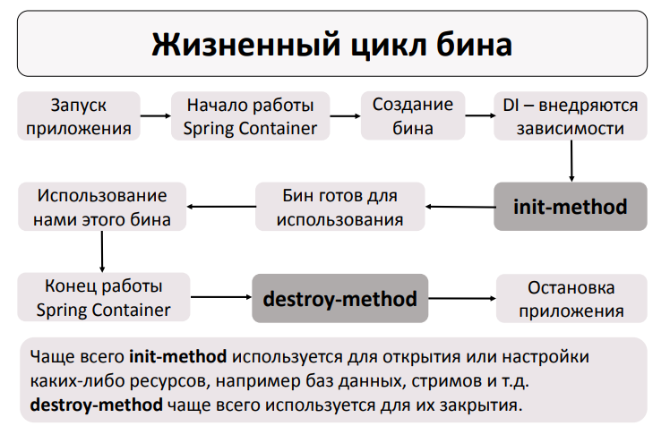

<h1 align="center">
    Жизненный цикл бина
</h1>

*Тут сложно, но это для бщего развития. В своих ЛР можете не использовать приемы описанные здесь.*



**Init-method** - метод выполняющийся после создания бина и внедрения зависимостей. Используется для открытия или
настройки каких-либо ресурсов, например баз данных, стримов и т.д.

**Destroy-method** - метод выполняющийся при остановке и очищении Spring-контейнера, при уничтожении объекта.

Передавая управление объектами Spring-у мы можем быть уверены когда отработают данные методы, в отличии от
стандартного ```finalize``` и тд. Но всё равно механизм спорный, всегда есть способ обойти его. В данном случае они
рассматриваются просто чтобы продемонстрироваться жизненый цикл бинов.

*Чтобы использовать данные методы при работе с контекстом не через XML-файл, а аннотации необходимо подключить
jakarta.annotation-api и использовать аннотации ```@PostConstruct``` и ```@PreDestroy```*

<h3>
    Особенности работы данных методов
</h3>

- У данных методов access modifier может быть любым.
- У данных методов return type может быть любым. Но из-за того, что возвращаемое значение мы никак не можем
  использовать, чаще всего return type – это void.
- В данных методах не должно быть параметров.

<h5>
  Особенности работы с Prototype
</h5>

Если у бина scope = prototype, то:

- init-method будет вызываться для каждого новосозданного бина.
- для этого бина destroy-method вызываться не будет.
- программисту необходимо самостоятельно писать код для закрытия/освобождения ресурсов, которые были использованы в бине

<h3 align="center">
  Пример
</h3>

Пример: [ScopeTest.java](ScopeTest.java)