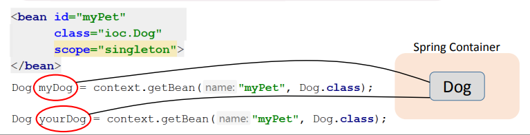
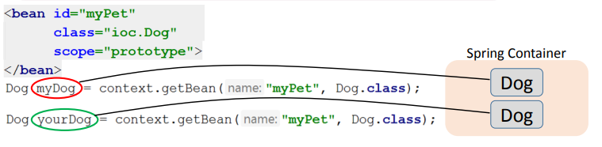

<h1>
    Scope 
</h1>

**Scope (область видимости)** определяет:

- жизненный цикл бина
- возможное количество создаваемых бинов

<h5>
    Разновидности Bean Scope
</h5>

В **Spring** определены следующие области видимости:

- Singleton
- Prototype
- Request
- Session
- Global-session

При выполнении ЛР вас интересуют **Singleton** и **Prototype**.

<h3 align="center">
    Singleton
</h3>

**Singleton** – дефолтный scope в Spring.

- такой бин создаётся сразу после прочтения Spring Container-ом конфиг файла.
- является общим для всех, кто запросит его у Spring Container-а.



<h3 align="center">
    Prototype
</h3>

**Prototype**

- такой бин создаётся только после обращения к Spring Container-у с помощью метода getBean.
- для каждого такого обращения создаётся новый бин в Spring Container-е.



<h3 align="center">
    Задание Scope
</h3>

Как несложно догадаться Scope можно задать двумя способами, в зависимости от выбранного способа работы с контекстом:
через XML-файл и аннотации.

**Лучшей практикой считается всегда явно прописывать Scope, даже если вам нужен Singleton, который по умолчанию**.

<h5>
    Задание Scope в XML-файле
</h5>

Если мы работает с контекстом через XML-файл, то при инициализации бина нееобходимо прописать отдельное свойство Scope.
*Scope по умолчанию - **Singleton***.

```xml

<bean class="scope.singleton.SingletonPerson" scope="singleton">
    <constructor-arg name="name" value="Petr"/>
    <constructor-arg name="lastName" value="Petrov"/>
    <constructor-arg name="age" value="25"/>
</bean>
```

Пример задания Scope через XML-файл: [singleton](singleton) + ```resources/singletonContext.xml```

<h5>
    Задание Scope через аннотацию
</h5>

Если мы работаем через аннотации, то у классов помеченных аннотацией ```@Component``` необходимо добавить аннотацию
```@Scope``` и внутри нее прописать необходимое значение ```"singleton"``` или ```"protype"```.

```java

@Component
@Scope("prototype")
public class PrototypeService {
    //
}
```

Пример задания Scope через аннотации [prototype](prototype)