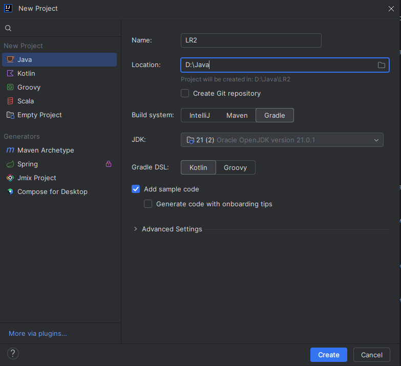
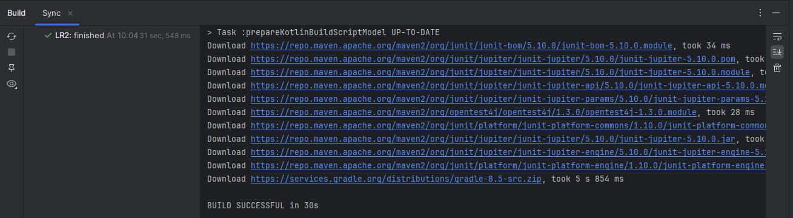
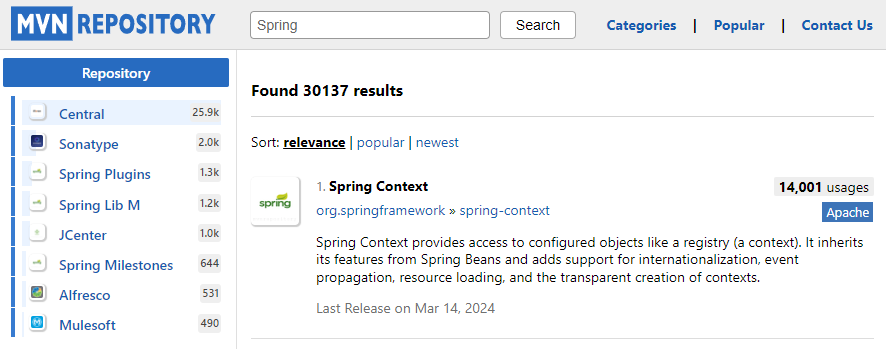
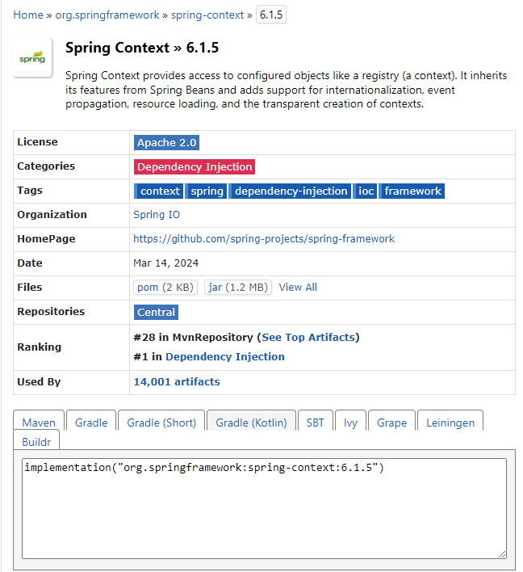
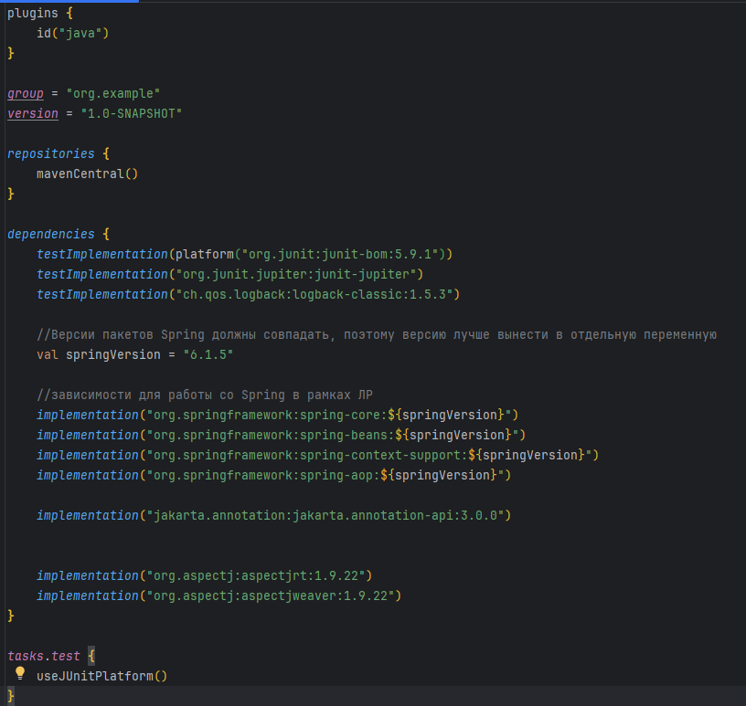
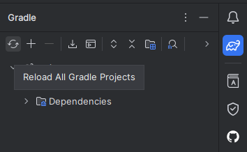

<h1 align="center">
    Система автоматической сборки 
</h1>

Ручная сборка проектов на Java довольно трудоёмкий процесс. Нужно правильно указать нужные проекту библиотеки и
фрэймворки, от которых проект зависит.

Рано или поздно вы начнёте создавать какие-то скрипты для автоматизации этого процесса. А теперь представте что так
делают все разработчики по всему миру и каждый пишет заново то, что кто-то уже написал для своего проекта. И тогда
появились в свет системы сборки проектов, которые автоматизируют этот процесс. Кроме того, позволяют с одной стороны
собрать Вам проект так, как Вы этого хотите, с другой стороны предоставляют вам более менее стандартизированные
средства.

При выполнении данной ЛР вы в праве использовать любую систему сборки. В качестве примера будет рассмотрена система
сборки Gradle со скрипотом на ЯП Kotlin.

*На данном этапе на самом деле не важно какие системы и на каких диалектах вы будете использовать, так как дальше
добавления зависимостей дело не уйдет, а оно везде одинаково.*

<h3>
    Gradle
</h3>

Первой системой автоматической сборки в **Java** мире стал **Ant** в 2000, затем в 2004 вышел **Maven.** Обе системы
использовали XML синтаксис.

В 2006 году появилась первая версия Gradle. Она позволила решить основные проблемы:

- реализацию больших многомодульных сборок путем последовательного и параллельного выполнения основных и добавочных
  модулей;
- ускорение сборки за счет кеширования компонентов через общую сеть с использованием Gradle Build Cache;
- управление зависимостями, то есть подключаемыми к проекту фреймворками, библиотеками и другими компонентами;
- упрощение рабочего процесса за счет автоматизации типовых задач и веб-визуализации сборки.

Gradle использует многие решения, которые применяются в Ant и Maven. Три системы широко интегрированы друг с другом:
проект, разработанный для одной из них, можно собрать в другой. Например, основным источником подключаемых внешних
компонентов в Gradle является хранилище Maven.

**Для вас же главным отличием между системами сборки на данный момент является лаконичность Gradle по сравнению с
остальными.**

<h3>
  Работа с Gradle в Intellij IDEA
</h3>

Проект на Gradle предлагается создавать средствами Intellij IDEA, так как в ней уже заложен плагин автоматизации работы
с Gradle. Таким образом создание проекта при помощи Gradle ничем не отличается от создания простого Java проекта.

<h5>
  Шаг 1. Создание проекта
</h5>

1. В меню создания проекта выберите Java, укажите название проекта и его расположение.
2. В качестве Build System выберите Gradle.
3. Укажите версию JDK (17+).
4. В качестве Gradle DSL выберите Kotlin.
5. Нажмите Create.



<h5>
  Шаг 2. Дождитесь инициализации проекта и загрузки базовых зависимостей
</h5>



<h5>
  Шаг 3. Добавление зависимостей из Maven Repository
</h5>

Все крупные, известные и проверенные библиотеки можно найти в [Maven Repository](https://mvnrepository.com/).

1. Вбиваете название нужной библиотеки/фреймворка.



2. Выбираете версию библиотеки и находите строку с подключением зависимости. Нас интересует строка для системы сборки
   Gradle с DSL Kotlin - Gradle(Kotlin).



3. Скопированную зависимость вставляете в секцию ```dependencies``` файла **build.gradle.kts**.



4. Пересобираете Gradle проект со вставленными зависимостями.



Дождиаемся удачной сборки проекта и можно работать. В вашем проекте появяться нужные подключенные библиотеки.

**Перечень нужных зависимостей можете скопировать из репозитория с примерами**.