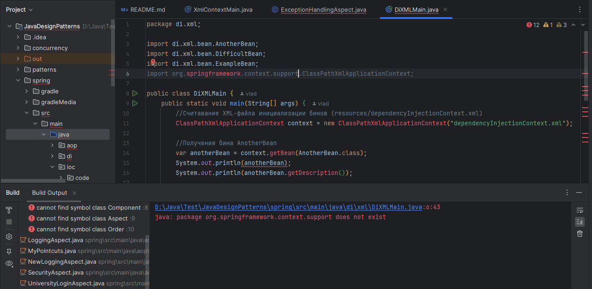
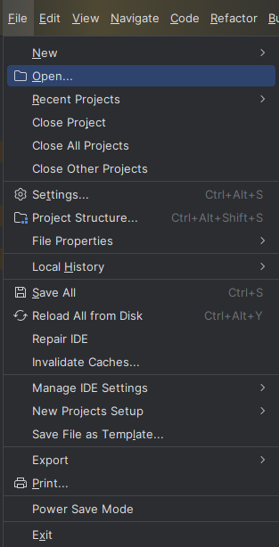
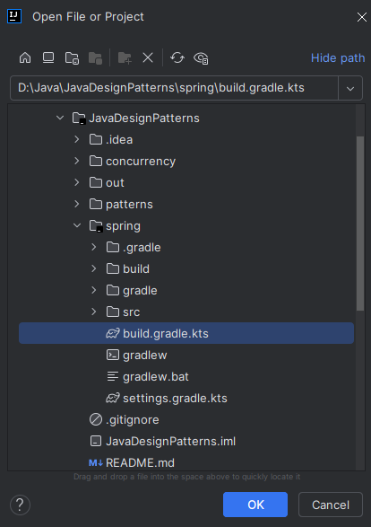
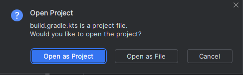
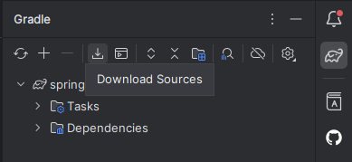
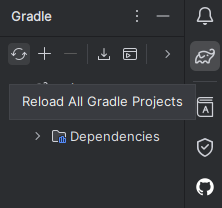

<h1 align="center">
    Как запустить проект 
</h1>

Поскольку данный проект со Spring и сборщиком проектов Gradle является модулем другого проект (проект в проекте) , то
при клонировании с гита может получиться следующая ситуация:

Не читаются зависимости загруженные Gradle. У данной проблемы есть несколько путей решения, самый простой заключается в
том, чтобы открыть данный моудль как отдельный Gradle проект в Intellij IDEA.

<h5>
    Шаг 1. В меню File Intellij IDEA выбрать пункт Open
</h5>

<h5>
    Шаг 2. Выбрать данный модуль. ОБЯЗАТЕЛЬНО выбираем файл build.gradle.kts для отркытие и сборки проект через Gradle!!!
</h5>

<h5>
    Шаг 3. Open as project.
</h5>

Далее выбираете открыть в этом окне или новом на ваше усмотрение.

<h5>
    Шаг 4. Ждем сборки
</h5>

Сборка жолжна начаться автоматически. По её окончанию всё должно начать работать.

В противном случае, если автомаической загрузки не происходит вы всегда можете загрузить зависимости:

И пересобрать проект:

Эти действий должно хватит. Если не работает - значит проблемы уже не в Gradle проекте, а где-то на другом уровне.

<h3 align="center">
    Удачи в постижении Spring.
</h3>h
